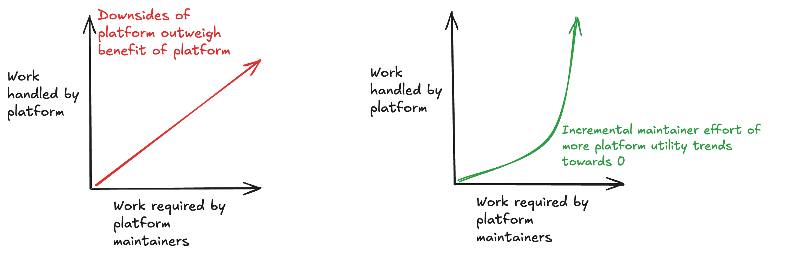

## Define platform

For our purposes, a platform is a piece of software for which the users are internal to your company.

## Why build software?

Before digging into the question of how to build a good platform, why do we build software at all?

> "Managing complexity is the most important technical topic in software development. In my view, it's so important that Software's Primary Technical Imperative has to be managing complexity. Complexity is not a new feature of software development.”
― Steve McConnell, Code Complete

> “Reduce complexity. The single most important reason to create a routine is to reduce a program's complexity. Create a routine to hide information so that you won't need to think about it.”
― Steve McConnell, Code Complete

What I like about this, is that if I’m unsure about a change, I can ask, “does this reduce complexity”. If the answer is yes, then we’re probably on the right track

## Why build a platform?

Platform builders have some big disadvantages!
- Impact on the end customer is indirect
    - my first job was data infrasturcure, i used to say i might as well work at a balloon factory
    - this means business leaders have less context
- They have high upfront cost
- It introduces abstractions all users need to understand
- The need to support many use cases tends to make platform software less agile
- platforms increase the cost of alternative approaches
- Platforms are a shared resource for very different use cases, so improvement requests are difficult to prioritize

What is a platform’s value?

### Bad north star #1: Standardize

- you can standardize on the wrong thing, locking out other approaches.
- a platformed approach effectively _increases_ the cost of non-platformed approaches

but sometimes, standardizing can increase complexity by forcing users to fit their square peg use case into the round hole of a centralized interface.

### Bad north star #2: Centralize
Indirect customer impact means that you are less customized, and less nimble.

if users _must_ go through your platform, it's possible that there is more effort in using your platform than if they were to do it themselves.

### Good north star: Force Multiply

It force multiplies its users, by doing a repetitive task more efficiently than they can do themselves.
Productivity gains should be exponential. As the platform handles more work, proportionally less work should be required of maintainers

Good platforms force multiply by:
- decreasing the time spent to do a repetitive task
- decreasing the cognitive overhead of doing a task
- increasing performance of a task

database team:
- specialized in keeping databases going
-

# A bad platform: Ice Cream Cone Delivery Platform

To keep morale high, we introduce sq-ice-cream!
User types sq ice-cream,and someone from the Oakland office flies to wherever they are and gives them ice cream!

By metrics often used to measure platforms, the Enterprise Ice Cream Cone Platform looks pretty good:
- It standardizes: Now when employees want ice cream, they don’t have to think about how to go about it!
- It centralizes: Now we’re not paying engineers to implement their own ways of getting ice cream thousands of times!
- It has high adoption: Everyone’s using it!

Why would investing in such a platform be ridiculous? It lacks _force multiplication:
- The task it centralizes is very simple - a simple stipend to allow employees to buy their own ice cream.

## How to force multiply?

### Self service
Self service is a reliable route for force multiplication
Computers do the work of supporting customers
It makes prioritization easier
- Support wants onboarding support
- Lending wants onboarding support
We only have staffing to do 1
Self service lets the platform avoid this question!

A key sign of a suboptimal platform is direct prioritization of specicic customers
- delivery is slower, product team roadmap changes more often
- often times deliver project, then need evaporates

## Antipatterns

### use one feature, use them all

this _forces_ users to adopt the platform, suboptimal for users,

### code changes as onboarding

code changes scale linearly with number of users

### Meta-platform: internal representation of company
- concept of ownership needs to survive reorgs, changed priorities

### Long term bet
Platform specific metrics can:
- Demonstrate alignment
- Demonstrate performance
- Demonstrate progress
Drawbacks of platform specific metrics:
- Business leaders probably lack context

### Make platform team responsible for a problem, not a service
- don't build a greenfield thing that does not take into account the messy specifics of actual use cases
https://www.joelonsoftware.com/2000/04/06/things-you-should-never-do-part-i/

### Measuring platforms is hard
- adoption: are we adopting the right thing?
- surveys: hard to get people to do, are users aware of alternatives?

good measurments:
- progress
- performance
- alignment
- SLO's / SLA's

## Signs of a good vs bad platform:
- platform maintainers are barely aware of new use cases / platform maintainers need to build extensive new features to support new use cases
- platform feature requests are applicable to many customers / platform feature requests are unique to each use case
