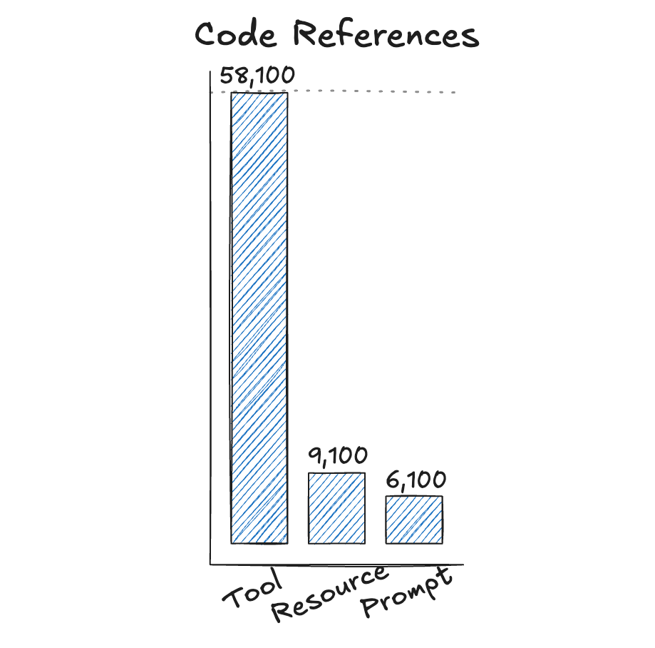
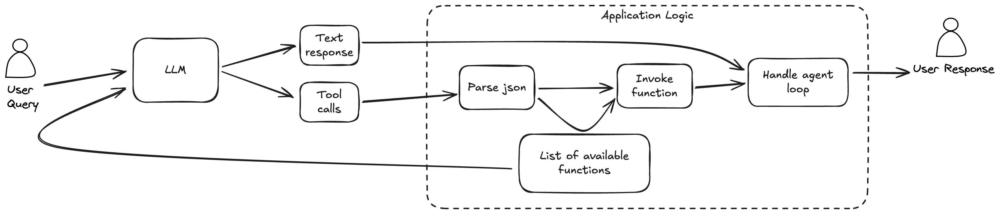
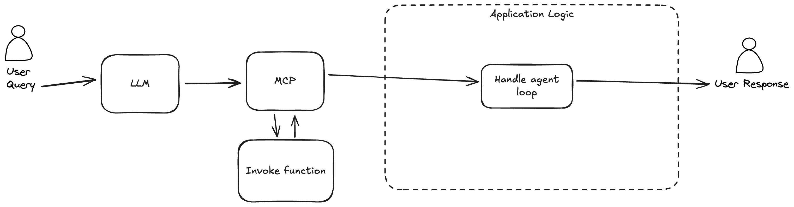
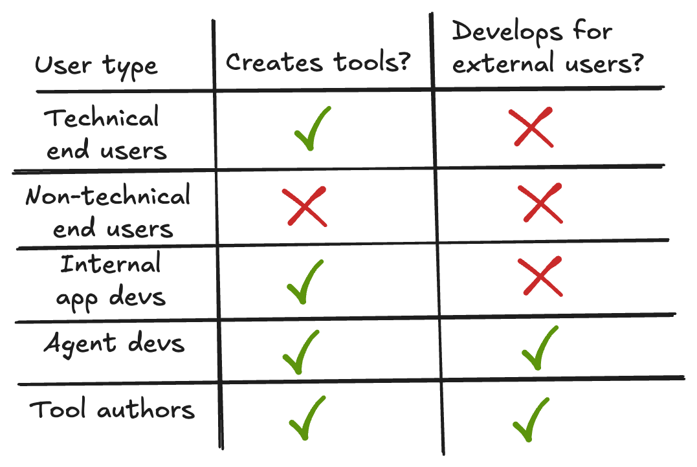
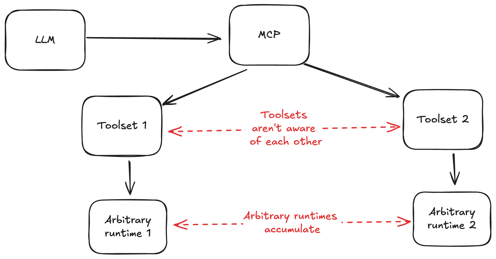
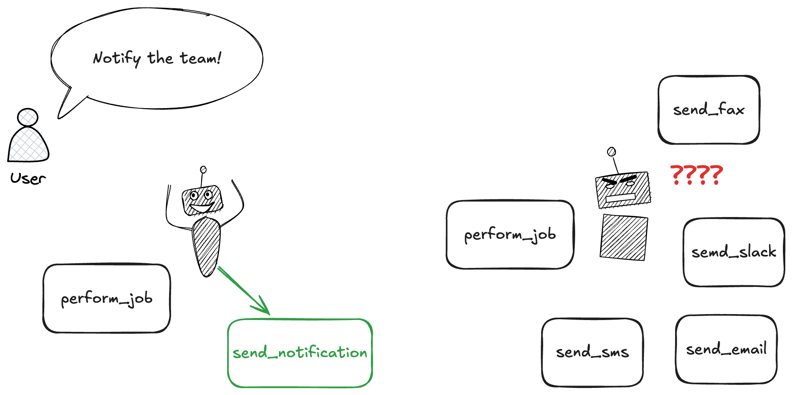
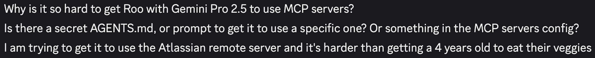
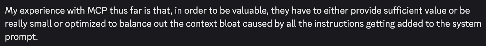
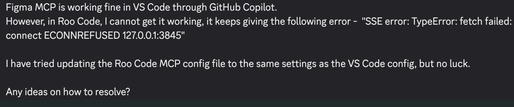

## Overview

MCP took off as a standardized platform for AI projects - it's difficult to justify _not_ supporting it. However, this popularity will be short lived (if it's not already fading).

Some of the popularity has been driven by misconception about what MCP actually uniquely accomplishes, but the majority is due to the fact that it's _very easy_ to add an MCP server. For a brief period, it seemed like adding an MCP server was a nice avenue for getting attention to your project, which is why so many projects have added support.

There are misconceptions about what MCP actually accomplishes, aspirations that have been unmet, and major architectural problems.
<!-- feedback: Strong hook and thesis; consider tightening this to a single paragraph that previews the three pillars (misconceptions, unmet aspirations, architectural costs) to set a clearer roadmap for the reader. -->

## What is MCP?

MCP is meant to solve the "NxM problem" - with many toolsets and many agents, there's a potential for lots of bespoke connector implementations to arise:

MCP is not _just_ about tool calls - it also has primitives for prompt libraries and _resources_. But adoption of these other primitives is much lower than tools [^1]:



Given the disproportionate focus of users on tool calling, it's worth digging deeper into what tool calling looks like with or without MCP.
<!-- feedback: Good framing; add one sentence that explicitly names the three primitives (tools, resources, prompts) and says you’ll focus on tools because adoption skews there, so readers know why the rest of the piece zooms in. -->


### Tool calling without MCP
It's a misconception that MCP is _necessary_ for function call support. With "tool calling models", a list of available tools is provided to the LLM with the chat completion request. If the LLM wants to call a tool, it returns JSON formatted tool parameters, alongside response intended to be user visible:"



Actually providing the list of available tools and their schemas, parsing out tool call parameters, and executing tool calls are left to the application.

#### The NxM problem

A user who wishes to reuse a toolset with different agents has an annoying problem: configuring tool access is slightly different across different agents.

For example, tools are exposed to [Gemini's API](https://ai.google.dev/gemini-api/docs/function-calling?example=meeting#rest_2) via a `functionDeclarations` parameter with a `tool` parameter:


```bash
curl "https://generativelanguage.googleapis.com/v1beta/models/gemini-2.5-flash:generateContent" \
  -H "x-goog-api-key: $GEMINI_API_KEY" \
  -H 'Content-Type: application/json' \
  -X POST \
  -d '{
    "contents": [
      {
        "role": "user",
        "parts": [
          {
            "text": "Schedule a meeting with Bob and Alice for 03/27/2025 at 10:00 AM about the Q3 planning."
          }
        ]
      }
    ],
    "tools": [
      {
        "functionDeclarations": [
          {
...
```

In OpenAI's API, tool schemas are provided via a `tools` parameter:

```bash
curl -X POST https://api.openai.com/v1/responses \
  -H "Authorization: Bearer $OPENAI_API_KEY" \
  -H "Content-Type: application/json" \
  -d '{
    "model": "gpt-5",
    "input": [
      {"role": "user", "content": "What is the weather like in Paris today?"}
    ],
    "tools": [
      {
        "type": "function",
        "name": "get_weather",
        "description": "Get current temperature for a given location.",
        "parameters": {
          "type": "object",
          "properties": {
            "location": {
...
```

This is the "NxM" problem - where in theory, the number of connectors a user must build is N (the number of agents) x M (the number of toolsets).

Note, however, the logic here is largely the same. Schemas are generated in JSON, there's just slightly different API's for exposing the tool to the agent.

There are many frameworks for standardizing this. In Python, [LangChain](https://python.langchain.com/docs/how_to/function_calling/), [LiteLLM](https://docs.litellm.ai/docs/completion/function_call), [SmolAgents](https://huggingface.co/learn/cookbook/en/agents), and others all provide interfaces for exposing tools to different models. In contrast to MCP, all of these options _execute tool calls in the same runtime as the agent_.
<!-- feedback: Clear explanation; consider trimming the long API excerpts and instead summarize the differences (parameter names, JSON shape) to keep the section snappy, since the point is “minor API divergence, same semantics.” -->

### Tool Calling with MCP

MCP handles exposing and invoking tools for you:



Here, the function invocations are handled by a separate process altogether. Orchestrating the agent loop and providing results to the end user remain the application's responsibility. A JSON configuration controls which functions to expose.

This abstracts several major concerns away. Since functions are invoked in a separate process, resource management is opaque to the application. The logic and instructions for each tool is also not controlled by the application.
<!-- feedback: Spell out the deltas vs “without MCP” (who owns schema generation, transport, invocation, logging/auth). Also note the cost (extra hop/process boundary) so the reader sees both trade-offs before the Problems section. -->

### Who are the users?

There are a few different possible users who interact with MCP:



- _Technical end users_ want to create tools and share them between different agents they might want to use.

- _Non-technical end users_ want to use different tools while using agents. Note that this user group for MCP is, at present, largely theoretical. Exposing toolsets to MCP involves editing JSON, making it out of reach for non-technical users.

- _Internal app devs_ run production AI applications.

- _Agent devs_ create agents for external users. They wish to enable their end users to swap in whatever toolsets they like.

- _Tool authors_ create toolsets they wish to expose to users. MCP provides a way to easily share their work to users of different agents.
<!-- feedback: Helpful segmentation; add a one-liner tying this back to the thesis (e.g., most beneficiaries are technical, so the touted “non-technical” audience is still underserved). -->


## Problems

The convenience of MCP comes with a price, stemming from two architectural attributes of an MCP driven application:



Since tools are drawn from arbitrary sources, they are not aware of what other tools are available to the agent. Therefore their instructions can't take logic from other sources into account in their own instructions.

The second stems from different toolsets having their own runtimes. This introduces a variety of issues I'll discuss below.
<!-- feedback: Good setup; explicitly preview the two problem buckets (toolbox coherence and arbitrary runtimes) and the consequences (worse tool selection, ops/security overhead) to guide the reader. -->

### Incoherent toolbox

Tool selection depends not just on the job at hand, but also what tools are available. Are pliers the right tool to pull out a nail? It depends on the nail, how deeply the nail is driven into a surface. But it also depends on _what other tools are available_. If a hammer is available, it might be better, but if you don't have a hammer you should use pliers. In isolation, you cannot provide good instructions on when a tool can be useful.

A good handyman has a well organized toolbox, tailored to the types of jobs they might do. Is a hammer the right tool for a job?

Agents tend to be less effective at tool use as the number of tools grow. With well organized, coherent toolset, agents do well. With a larger, disorganized toolset, they struggle. For example, consider a workflow in which an agent should send a notification after doing work:



With a reused toolset, we're obliged to deal with this situation with prompting outside of the toolset.

If the toolset is controlled by the same authors as the application, they can add prompting to the toolsets to disambiguate when to use which tool. If not, the problem must be solved by _more prompting_.

Looking through #mcp channels of open source coding agents, you'll invariably find users who struggle to get the agent to use the tools in the way they want:



Or, users complaining of how many tokens are burned by tool instructions:



Best of all is to limit what tools are exposed to the agent only to those that make sense.
<!-- feedback: Nice anecdotes/diagrams; consider tightening the analogies and end with a concrete mitigation (curate toolsets per task, avoid mixing overlapping tools) to give readers an action, not just a warning. -->

### Arbitrary, separate runtimes (TODO)

Each MCP server [starts a separate process](https://modelcontextprotocol.io/specification/2025-03-26/basic/lifecycle) that survives for the length of the agent session.

Even in the healthy state, this introduces a collection of processes that remain mostly idle, aside from serving occassional requests from an agent. In an error state, we get all the usual headaches: dangling subprocesses, memory leaks, resource contention.

Users have these issues, if they are able to get the servers running at all: in support channels, the most common complaint is difficulty getting the servers to run:



MCP does not provide any way to provide the host with runtime requirements. Some servers solve this by cramming install into the server instantiation command, e.g. `uv run some_tool mcp`. This works great, if for example, the user has `uv` installed.

Even if the relevant package is there, the MCP server might not start it successfully. MCP servers only inherit [a subset of parent ENV variables](https://modelcontextprotocol.io/legacy/tools/debugging#environment-variables) (`USER`, `HOME`, and `PATH`). This is particularly problematic for `nvm` or users leveraging virtual environments.


I'm personally comfortable debugging Python env issues (although MCP's subprocess orchestration makes this more difficult), but much less comfortable debugging Node. MCP seems to assert that I as the user should not really care which runtime I'm using.

Even if all of my MCP runtimes are Python, MCP potentially spins up many instances of it, obviating any cache, connection pooling, etc.

### Security

Agent executing code is a scary proposition. MCP makes this worse, by potentially pulling in arbitrary code, driven by a manipulable agent.

The risk isn't theoretical: MCP has already been associated with several serious breaches:

TODO: List of incidents, with links

<!-- RESEARCH NOTES: Process Orchestration

Architecture:
- Each MCP server runs as a separate process with its own runtime/dependencies/lifecycle
- Stdio transport: Client launches server as subprocess, communicates via stdin/stdout (newline-delimited JSON-RPC)
- HTTP transport: Server runs as independent HTTP service, supports multiple clients, uses POST + optional SSE
- Process lifecycle: Initialize → Operation → Shutdown (SIGTERM → SIGKILL on stdio)

Process Management Issues:
- Environment isolation: Servers inherit only USER, HOME, PATH; macOS apps don't inherit shell PATH mods (causes nvm/rbenv issues)
- Working directory may be undefined (like / on macOS) - requires absolute paths everywhere
- Opaque resource management: Each server has separate runtime, no shared connection pooling/caching
- Cold start penalties for on-demand servers
- Silent failures: Claude Desktop doesn't show config validation errors, invalid JSON silently fails
- Common errors: "BrokenPipeError" from timing issues, "Server transport closed unexpectedly"
- Debugging complexity: Errors cross process boundaries, stack traces fragmented, logs scattered
- No automatic retry/health checking - application must monitor all server processes

Security Vulnerabilities (2025):
- CVE-2025-6514 (CVSS 9.6): Remote Code Execution in mcp-remote
- CVE-2025-53109/53110 (CVSS 8.4/7.3): Sandbox Escape vulnerabilities
- CVE-2025-52882 (CVSS 8.8): Authentication Bypass
- Protocol mandates session IDs in URLs (violates security best practices)
- No authentication requirement in spec - 492 servers found publicly exposed without auth
- Real incidents: Supabase cursor agent leaked tokens via SQL injection (mid-2025), Asana customer data breach (June 2025)
- Attack vectors: Prompt injection, tool poisoning, command injection, plaintext credentials in config files

Resource Inefficiency:
- Each server maintains separate runtime, dependencies, memory footprint
- Multiple Python/Node interpreters running simultaneously
- No shared caching or connection pooling across servers
- Process startup overhead + IPC serialization/deserialization overhead

Sources:
- https://modelcontextprotocol.io/docs/learn/architecture
- https://modelcontextprotocol.io/specification/2025-06-18/basic/transports
- https://modelcontextprotocol.io/specification/2025-03-26/basic/lifecycle
- https://modelcontextprotocol.io/legacy/tools/debugging
- https://noailabs.medium.com/mcp-security-issues-emerging-threats-in-2025-7460a8164030
- https://equixly.com/blog/2025/03/29/mcp-server-new-security-nightmare/
- https://www.practical-devsecops.com/mcp-security-vulnerabilities/
- https://techcommunity.microsoft.com/blog/microsoft-security-blog/understanding-and-mitigating-security-risks-in-mcp-implementations/4404667
- https://nishtahir.com/notes-on-setting-up-claude-desktop-mcp-servers/
-->


### The convenience gained is minimal

These problems could be worth the cost, if we were to gain significantly. But comparing tool calling with MCP to that without, it's remarkable how little MCP is actually handling. MCP is, more or less, handling serializing function call schemas and responses.

The tools developers are saving themselves from having to write are, overwhelmingly, [relatively thin wrappers around API clients](https://mcp.alphavantage.co/?utm_source=mcp.so&utm_medium=referral&utm_campaign=202508&utm_id=000001&utm_term=web_project&utm_content=v2), or [utility scripts](https://mcp.so/server/time/modelcontextprotocol). These in the former case, the user must still obtain API keys, billing accounts, etc.

This code _was_ a hassle to write, prior to the advent of coding agents. But these small utility scripts are the precise thing that coding agents excel most at! A technical user of MCP tools will be hard pressed to find a tool an agent could not one-shot in the programming language they are most comfortable in.

<!-- RESEARCH NOTES: Minimal Convenience

What MCP Actually Does:
- Serializes function schemas to JSON-RPC format
- Routes tool calls to correct process
- Marshalls responses back
- That's essentially it - the "value add" is tiny

What Application Still Must Do:
- Orchestrate the agent loop
- Handle tool selection logic (which tools to expose when)
- Parse and present results to users
- Manage conversation state
- Error recovery and retry logic
- Monitor server health
- Manage server lifecycle (start/stop/restart)

The Overhead Added:
- Application → JSON-RPC → Subprocess → Tool Execution (MCP)
- vs Application → Function Call → Tool Execution (direct)
- MCP adds: Process startup, IPC serialization, process monitoring, complex debugging, security boundaries
- MCP removes: Adapter code for different LLM APIs (but LangChain/LiteLLM already solve this in-process)

Simpler Alternatives Exist:
- SDK libraries (LangChain, LiteLLM, SmolAgents) solve API divergence without process boundaries
- Most apps use 1-3 servers - at that scale, direct integration is simpler and more maintainable
- The "interoperability" is illusory - still need custom code to integrate each toolset meaningfully

Sources:
- https://modelcontextprotocol.io/docs/learn/architecture
- https://python.langchain.com/docs/how_to/function_calling/
- https://docs.litellm.ai/docs/completion/function_call
-->

## Why it took off (TODO)

With these issues, it's fair to wonder why MCP has gained the poopularity it has. It has had lots of support from Anthropic, and no trouble gaining traction with toolset publishers, agent providers, and enterprises. Why? It helps narratives.

MCP is often described as an "app store". But it's not an app store. It's not even a package manager. It's an overengineered orchestration protocol.

### Tool authors: A low overhead marketing channel

It's quite easy to publish an MCP server. The lack of startup requirements means you don't even need to publish to `npm` or `pip`: you can simply add an annotation, and publish a json blob.

This provides a nice narrative to gain attention to AI projects: A user can, in theory, easily add some MCP tools from a project, gain value, and follow interest in learning more about the project. Support overhead will, in the main, fall to agent maintainers.

Once publishers starting appearing, it became difficult to justify _not_ supporting MCP. Your project could be perceived as being against open standards.

### Enterprise: AI credibility

Over the last few years, any SF billboard watcher witnessed a rebranding of enterprise tools towards AI. MCP support provided an easy way to make your e.g. project management tool be AI. The branding of MCP as an "open standard" increased pressue to adopt - lack of MCP support could signal a lack of willingness to adopt open standards.

### Anthropic: Open source credibility

MCP's status as _the_ open standard for AI and the adoption of enterprise greatly benefited Anthropic. The big fear of investors is taht enterprise adoption doesn't persist - adoption of Anthropic's open standard helped this.


## Alternatives


- Local tools: justfiles
- Remote API's: thin API wrappers
-

<!-- RESEARCH NOTES: Why It Took Off

Easy to Publish:
- Template/boilerplate makes "hello world" MCP server trivial
- Low barrier → flood of servers (58.1K @mcp.tool references on GitHub)
- Appears like ecosystem momentum
- GitHub star farming - easy way to get attention for existing projects
- "Add MCP support" became a marketing checkbox

Enterprise/AI Mutual Credibility Hype:
- Anthropic: Gained enterprise credibility by appearing "platform-like"
- Enterprises: Gained AI credibility by adding MCP to existing tools (Jira, Linear, Asana, etc.)
- "App store" narrative sounds appealing to business stakeholders
- Timing: Launched during peak AI tooling hype cycle (late 2024)
- December 2025: Anthropic donated MCP to Agentic AI Foundation (Linux Foundation) - co-founded by Anthropic, Block, OpenAI, with Google, Microsoft, AWS, Cloudflare, Bloomberg
- Microsoft Build 2025: Windows 11 announced early preview embracing MCP as "foundational layer"

Misconceptions Amplified Adoption:
- Many believe MCP is *required* for tool calling (it's not - tool calling is native LLM capability)
- "Standardization" sounds like a must-have, even when unnecessary
- Network effects: Once Claude supported it, other agents felt pressure to add support
- Confusion between "MCP enables tool calling" vs "MCP standardizes tool calling across agents"

Sources:
- https://blog.modelcontextprotocol.io/posts/2025-11-25-first-mcp-anniversary/
- https://www.anthropic.com/news/model-context-protocol
- https://blogs.windows.com/windowsexperience/2025/05/19/securing-the-model-context-protocol-building-a-safer-agentic-future-on-windows/
-->


## Alternatives (TODO)

### Local scripts

For a technical user, letting an agent invoke scripts directly is very difficult to beat. Useful 50-100 line scripts are _extremely_ easy to write with AI coding agents. Care needs to be taken to filter output - raw build scripts can stream verbose logs into agent context, eating up tokens.

Robust security against agent actions going haywire can be achieved via command runners like `just` or `make`. Agents allow you to specify what command prefixes can be invoked without approval - put your agent commands in a `justfile`, and only auto-allow shell commands prefixed with `just`.

This approach also exposes tools to humans, and is a nice approach for improving dev environments for humans and AI agents at the same time (TODO: link to make-it-easy-for-humans post)

### 1st Party Tools

For a self contained application, there is little reason to separate tool codebases from the codebase for the rest of the application. Tools can be dynamically exposed to the agent based on application context.

### Generic API Wrappers: OpenAPI / REST

Generic API wrappers like OpenAPI and REST offer all of the self-describing capabilities offered by MCP, with decades of battle testing.

Similar to scripts, some glue is necessary between a raw API and an agent, to manage output verbosity and add context. But tools need descriptions and ideas for how they should be used in relation with each other.

Security is already accounted for. Tokens, service identitiess already work very well. OAuth already enables automated actions taken on behalf of a user, service identities, etc.

### SDK's / Libraries

Language specific SDK's provide robust options for bridging the annoying differences in the API's of different model providers.


- local scripts
    -
- 1st party tools
    - dynamically exposed based on situation
- generic wrapped handling transport (API)
    - the heavy lifting of interoperability is done by API

<!-- RESEARCH NOTES: Alternatives to MCP

Local Scripts:
- Simple bash/Python/Node scripts exposed via shell tool
- Agents already have shell execution capability
- No protocol overhead, trivial to debug
- Example: `weather.sh --city Paris` vs MCP weather server
- No process management complexity
- Direct control over execution environment

1st Party Tools (Application-Controlled):
- Tools defined in same codebase as agent
- Dynamically exposed based on context (only show relevant tools per task)
- Coherent instruction sets - tools know about each other
- Full control over resource management, logging, auth
- No IPC overhead - direct function calls
- Example: Cursor's built-in file operations vs generic filesystem MCP server
- Easier debugging - single process, unified stack traces
- Examples in practice: Cursor, Aider, Continue.dev all use primarily 1st-party tools

Generic API Wrappers (OpenAPI/REST):
- Heavy lifting already done by HTTP/REST standards
- Agent can call APIs directly via HTTP tool (agents already have this)
- OpenAPI specs are already LLM-readable (self-describing)
- No new protocol needed - decades of tooling/security/monitoring
- Example: GitHub REST API vs GitHub MCP server
- Better auth story - OAuth, API keys, standard practices
- Example: Agents can already use Jira API, Linear API, etc. without MCP

SDK/Library Approach (LangChain, LiteLLM, SmolAgents):
- Handles API divergence in-process (Gemini vs OpenAI vs Claude tool format)
- Share tool definitions across models without process boundaries
- Mature ecosystem, good debugging, type safety
- Lower latency than IPC
- No separate process management
- Examples: LangChain Tools, LiteLLM function calling, HuggingFace SmolAgents


Key Insight from Research:
- MCP is not an agent framework - it's an integration layer
- Complements frameworks like LangChain/LlamaIndex, doesn't replace them
- Most apps still need orchestration framework PLUS MCP if using it
- At 1-3 tools, direct integration is simpler than MCP + orchestration framework

Sources:
- https://python.langchain.com/docs/how_to/function_calling/
- https://docs.litellm.ai/docs/completion/function_call
- https://huggingface.co/learn/cookbook/en/agents
- https://modelcontextprotocol.io/docs/learn/architecture
- https://www.keywordsai.co/blog/introduction-to-mcp
-->


[^1]: Source: Github searches for [@mcp.tool](https://github.com/search?q=%40mcp.tool&type=code) (58.1K results), [@mcp.resource](https://github.com/search?q=%40mcp.resource&type=code) (9.1K), and [@mcp.prompt](https://github.com/search?q=%40mcp.prompt&type=code) (6.1K)


notes from HN:

• You’ve covered the core structure and tooling sections in your inline comments. The HN thread surfaces a few angles not yet addressed:

  - Pro-MCP end-user value: “app store”/consumer use case (Jira/Linear, Alibaba servers) and discoverability vs hand-wired REST/OpenAPI; clarify if/why that’s still overkill or when it’s legit.
  - Security/auth isolation: “socket without handing over tokens” as a claimed benefit; decide whether to rebut or scope it.
  - API spec comparison: why “just OpenAPI/text files/CLI” isn’t equivalent (or is); note the “self-describing enough for agents” bar.
  - Ops/reliability: comments about verbosity helping models, and reliability math for multi-agent chains; address determinism/retries vs non-determinism.
  - “Why replace it?”: if you argue “don’t use it,” offer the counter-pattern (SDKs, codegen/skills, CLI) explicitly.
